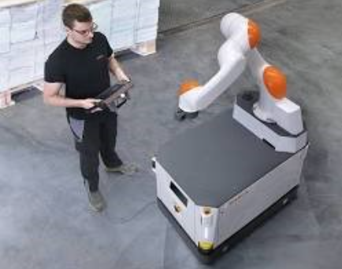

## Semana 1: Introducción a la Robótica 
## Día 1
## Introducción a los conceptos básicos de robótica

La robótica es un campo de la ingeniería que se ocupa del diseño, construcción, operación y aplicación de robots. Los robots son máquinas que pueden realizar tareas de forma automática, ya sea siguiendo un conjunto de instrucciones o respondiendo a su entorno. 

La robótica se basa en una amplia gama de disciplinas, incluida la ingeniería mecánica, la ingeniería eléctrica, la ingeniería informática y la ciencia de materiales. Los robots se utilizan en una variedad de aplicaciones, que incluyen fabricación, atención médica, agricultura y exploración espacial. (30min) 

https://www.youtube.com/watch?v=8I8nMtzN05s&ab_channel=20thCenturyStudios 

## Historia de la robótica 
La historia de la robótica se remonta a la antigua Grecia, cuando los inventores comenzaron a crear máquinas que podían moverse por sí mismas. Uno de los primeros ejemplos de un robot es el autómata de Anticitera, una máquina mecánica que se utilizó para predecir posiciones astronómicas. (PRESENTAR VIDEO GAFAS VR) 

 

El Mecanismo de Anticitera: 

Es un dispositivo de cálculo analógico complejo de la antigua Grecia. 

Se data entre los años 150 a. C. y 100 a. C. 

Se considera el primer ordenador analógico conocido. 

Se utilizó para predecir posiciones astronómicas, eclipses y juegos panhelénicos. 

Está hecho de bronce y tiene 30 engranajes. 

Se considera una maravilla tecnológica de la antigua Grecia. 

Se puede ver en el Museo Arqueológico Nacional de Atenas. 

En el siglo XVIII, el inventor francés Jacques de Vaucanson creó una serie de autómatas realistas, incluido un pato que podía caminar, nadar y comer. En el siglo XIX, el inventor estadounidense Joseph Jacquard desarrolló un telar que podía programarse con tarjetas perforadas. Este fue un avance importante en el desarrollo de la robótica, ya que demostró que las máquinas podían controlarse mediante instrucciones preprogramadas. 

El siglo XX vio un rápido desarrollo en el campo de la robótica. En la década de 1950, se desarrollaron los primeros robots industriales. Estos robots se utilizaron en fábricas para realizar tareas repetitivas como soldar y pintar.  

  

En la década de 1970, se desarrollaron los primeros robots manipuladores. Estos robots se podían utilizar para realizar tareas más complejas, como ensamblar componentes electrónicos.

  

En la década de 1980, se desarrollaron los primeros robots móviles. Estos robots podían moverse por su cuenta y podían usarse para tareas como limpieza y exploración. 

  

En la década de 1990, se desarrollaron los primeros robots humanoides. Estos robots podían caminar y hablar como los humanos, e incluso podían interactuar con su entorno de forma limitada.

  

El siglo XXI ha visto un mayor desarrollo en el campo de la robótica. Los robots ahora se utilizan en una variedad de aplicaciones, que incluyen atención médica, agricultura y exploración espacial. Los robots se están volviendo cada vez más sofisticados y capaces, y es probable que desempeñen un papel cada vez más importante en nuestras vidas en el futuro.

  

  

  

  

## Tipos de robots
Hay muchos tipos diferentes de robots, cada uno con sus propias capacidades y aplicaciones únicas. Algunos de los tipos de robots más comunes incluyen: 

Robots industriales: estos robots se utilizan en fábricas para realizar tareas repetitivas como soldar, pintar y ensamblar componentes. 

  

Robots manipuladores: estos robots se pueden utilizar para realizar tareas más complejas, como manipular objetos pequeños y realizar operaciones quirúrgicas. 

  

 

Robots móviles: estos robots pueden moverse por su cuenta y se pueden usar para tareas como limpieza y exploración. 

https://www.youtube.com/watch?v=t0YxmIv4KJ0&ab_channel=TecnologiaenElectronicayControlSRL 

https://www.youtube.com/watch?v=9t9R5fMqDVs&ab_channel=RIVUS%C2%AE  

  

 

Robots humanoides: estos robots pueden caminar y hablar como los humanos, e incluso pueden interactuar con su entorno de forma limitada. 

https://www.youtube.com/watch?v=cpraXaw7dyc&ab_channel=Tesla  

  

### Aplicaciones de robots en el mundo real 

Los robots se utilizan en una amplia variedad de aplicaciones en el mundo real. Algunas de las aplicaciones más comunes de los robots incluyen: 

Fabricación: los robots se utilizan en fábricas para realizar tareas repetitivas como soldar, pintar y ensamblar componentes. Los robots pueden ayudar a mejorar la precisión, la eficiencia y la seguridad en el entorno de fabricación. 

  

 

Atención médica: Los robots se utilizan en hospitales y clínicas para realizar una variedad de tareas, como realizar cirugías, administrar medicamentos y brindar rehabilitación. Los robots pueden ayudar a mejorar la precisión, la eficiencia y la atención al paciente en el entorno de atención médica. 

  

Agricultura: los robots se utilizan en granjas para realizar tareas como cosechar cultivos, plantar semillas y ordeñar vacas. Los robots pueden ayudar a mejorar la eficiencia, la productividad y la sostenibilidad en la industria agrícola. 

  

https://www.youtube.com/watch?v=hVvs6_Wx2HM&ab_channel=BillyLi  
 

Exploración espacial: los robots se utilizan para explorar planetas, lunas y asteroides. Los robots pueden ayudar a los científicos a aprender más sobre nuestro sistema solar y el universo. 

  

https://www.youtube.com/watch?v=V8PisoKmZG8&ab_channel=ROBOTZLAB 
 

### Conclusión 

La robótica es un campo en rápido desarrollo con una amplia gama de aplicaciones en el mundo real. Los robots se están volviendo cada vez más sofisticados y capaces, y es probable que desempeñen un papel cada vez más importante en nuestras vidas en el futuro. 
