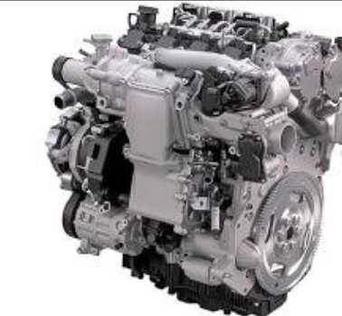

[Regresar](/BootcampsKidsESPOL/)

## Día 2 

Fundamentos de mecánica y electrónica. Introducción a componentes básicos como motores, sensores y microcontroladores. 

## Fundamentos de mecánica y electrónica 

La mecánica y la electrónica son dos disciplinas fundamentales que forman la base de muchas tecnologías modernas. La mecánica es el estudio del movimiento y las fuerzas que actúan sobre los objetos, mientras que la electrónica es el estudio del flujo de la corriente eléctrica en los circuitos. 

## Mecánica 

Los conceptos básicos de la mecánica incluyen: 

- Fuerza: Cualquier interacción que, al actuar sobre un objeto, tiende a cambiar su estado de reposo o de movimiento uniforme. 

Actividad, para a niños uno en frente del otro y se tomen de la mano (O CON UN MDF EN MEDIO DE SUS MANOS) y empiecen a empujarse progresivamente PERO DELICADAMENTE, y después aumentamos a niños detrás de cada uno y que apoyen empujando progresiva y cuidadosamente. 

- Masa: La cantidad de materia que contiene un objeto. 

- Peso: La fuerza gravitatoria que actúa sobre un objeto. 

- Aceleración: La tasa de cambio de la velocidad de un objeto. 

- Energía: La capacidad de realizar trabajo.  

Actividad: se pedirá a un niño que levante algo (que consideramos q no va a poder hacerlo, a continuación, llamamos a un segundo niño que lo ayude y así hasta conseguir que lo muevan o levanten y los mantengan alzados por unos minutos o segundos (CARTONES VACÍOS O CON PAPELES ADENTRO)   demostrando la energía que se necesita para realizar trabajos, después un segundo niño lo ayuda y verifican que es menso cansado                                                                                                
## Electrónica 

Los conceptos básicos de la electrónica incluyen: 

. Corriente eléctrica: El flujo de electrones a través de un conductor. 

- Voltaje: La diferencia de potencial eléctrico entre dos puntos. 

- Resistencia: La oposición al flujo de la corriente eléctrica. 

Actividad, un grupo de niños estará en conjunto parados de un lado sosteniendo una tabla fina q representará el voltaje constante, y cada uno de esos niños será una resistencia de 20Ω, y del otro lado un solo niño queriendo empujar, siendo este la corriente, después desplazaremos niño por niño del lado de las resistencias al lado de la corriente, para demostrar que, a menor resistencia, mayor corriente con un voltaje constante. 

## Componentes básicos 

### Motores 

Un motor es un dispositivo que convierte la energía eléctrica en energía mecánica. Los motores se utilizan en una amplia variedad de aplicaciones, desde automóviles y electrodomésticos hasta juguetes y robots.  

  

  

  

 

### Sensores 

Un sensor es un dispositivo que detecta cambios en el entorno y convierte esos cambios en una señal eléctrica. Los sensores se utilizan en una amplia variedad de aplicaciones, desde sistemas de seguridad y control ambiental hasta dispositivos médicos y robots. 

  

 

### Microcontroladores 

Un microcontrolador es un pequeño circuito integrado que se puede programar para realizar tareas específicas. Los microcontroladores se utilizan en una amplia variedad de aplicaciones, desde dispositivos electrónicos de consumo hasta automóviles y robots. 

  

 

  

 

### Aplicaciones 

La mecánica y la electrónica se utilizan en una amplia variedad de aplicaciones, incluyendo: 

- Automatización: La mecánica y la electrónica se utilizan para automatizar tareas en una amplia variedad de industrias, desde la fabricación hasta la agricultura. 

- Robótica: La mecánica y la electrónica se utilizan para construir robots que pueden realizar tareas de forma autónoma. 

- Transporte: La mecánica y la electrónica se utilizan para diseñar y construir vehículos, desde automóviles hasta aviones. 

- Comunicaciones: La mecánica y la electrónica se utilizan para diseñar y construir sistemas de comunicación, desde teléfonos hasta redes informáticas. 

- Medicina: La mecánica y la electrónica se utilizan para diseñar y construir equipos médicos, desde máquinas de rayos X hasta marcapasos. 

## Conclusión 

La mecánica y la electrónica son dos disciplinas fundamentales que forman la base de muchas tecnologías modernas. Al comprender los fundamentos de la mecánica y la electrónica, podemos crear una amplia gama de dispositivos y sistemas que pueden mejorar nuestras vidas. 

## Objetivos 

Al final de este taller, los niños podrán: 

- Definir mecánica y electrónica. 
- Identificar los componentes básicos de máquinas y dispositivos. 
-Explicar cómo funcionan los motores, sensores y microcontroladores. 
- Construir un circuito simple. 
- Programar un microcontrolador. 

## Materiales 

Para este taller, necesitarás los siguientes materiales: 

- Componentes básicos: 

    - Motores 
    - Sensores 
    - Microcontroladores 
    - Cables 
    - Baterías 
    - LEDs 
    - Resistencias 
    - Condensadores 

- Herramientas: 

    - Alicates 
    - Pelacables 
    - Destornilladores 
    - Multímetro 

- Otros materiales: 

    - Cartón 
    - Pegamento 
    - Tijeras 
    - Cinta adhesiva 

## Actividades 

Actividad 1: Introducción a la mecánica 

En esta actividad, los niños aprenderán sobre los conceptos básicos de la mecánica, como la fuerza, la masa, la aceleración y la gravedad. 

- Actividad 1.1: Construye una catapulta simple con cartón y otros materiales. Experimenta con diferentes pesos y ángulos para ver cómo afectan la distancia que recorre la pelota. 

- Actividad 1.2: Construye un carruaje con ruedas y ejes. Experimenta con diferentes pesos y pendientes para ver cómo afectan la velocidad del carruaje. 

Actividad 2: Introducción a la electrónica 

En esta actividad, los niños aprenderán sobre los conceptos básicos de la electrónica, como la corriente, el voltaje, la resistencia y la capacitancia. 

- Actividad 2.1: Construye un circuito simple con una batería, un LED y una resistencia. Experimenta con diferentes valores de resistencia para ver cómo afectan el brillo del LED. 

- Actividad 2.2: Construye un circuito simple con un sensor de luz y un LED. Experimenta con diferentes niveles de luz para ver cómo afectan el estado del LED. 

Actividad 5: Microcontroladores 

En esta actividad, los niños aprenderán sobre los microcontroladores y cómo se pueden utilizar para controlar dispositivos electrónicos. 

- Actividad 5.1: Programa un microcontrolador para que haga parpadear un LED. 

- Actividad 5.2: Programa un microcontrolador para que detecte la presencia de un objeto con un sensor de distancia y encienda un led. 

## Conclusión 

Este taller ha proporcionado a los niños una introducción a los fundamentos de la mecánica y la electrónica. A través de una serie de actividades prácticas, los niños han explorado los conceptos básicos de estas dos disciplinas y cómo se utilizan para crear máquinas y dispositivos. 