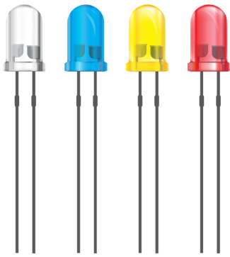

[Regresar](/BootcampsKidsESPOL/)

## Día 3 

## Marco Teórico 

**Definición:** Un LED (siglas en inglés de Light Emitting Diode) es un diodo emisor de luz. Es un componente electrónico semiconductor que emite luz cuando una corriente eléctrica lo atraviesa.  

  

Es un componente electrónico semiconductor que emite luz cuando una corriente eléctrica lo atraviesa. 

**Funcionamiento:** Los LED funcionan aprovechando el principio de electroluminiscencia. Cuando se aplica una tensión eléctrica a un LED, los electrones del material semiconductor se recombinan con los huecos, liberando energía en forma de luz. 

**Características:** 
- Color: El color de la luz emitida por un LED depende del material semiconductor utilizado. Los colores más comunes son rojo, verde, azul, amarillo y blanco. 

- Voltaje: La tensión de funcionamiento de un LED varía según el color. Los LED rojos, naranjas y amarillos suelen tener una tensión de funcionamiento de 1,8V a 2,2V, mientras que los LED verdes, azules y blancos suelen tener una tensión de funcionamiento de 3V a 3,5V. 

- Corriente: La corriente que circula por un LED debe ser limitada para evitar que se dañe. La corriente máxima recomendada para un LED suele ser de 20mA. 

**Aplicaciones:** Los LED se utilizan en una amplia variedad de aplicaciones, como: 

- Iluminación.
- Señalización.
- Displays. 
- Optoelectrónica.
- Telecomunicaciones.

2. Resistencia de 220 ohmios 

  

**Definición:** Una resistencia es un componente electrónico que opone resistencia al paso de la corriente eléctrica. 

**Funcionamiento:** Las resistencias se fabrican con materiales resistivos, como el carbono o el metal. La resistencia de un material se mide en ohmios (Ω). 

**Características:**

- Valor: El valor de una resistencia se indica en ohmios. Las resistencias de 220 ohmios son muy comunes en electrónica. 

- Tolerancia: La tolerancia de una resistencia indica la precisión de su valor. Las resistencias con una tolerancia del 5% son las más comunes. 

- Potencia: La potencia de una resistencia indica la cantidad de energía que puede disipar. Las resistencias de 1/4 de vatio son las más comunes. 

**Aplicaciones:** Las resistencias se utilizan en una amplia variedad de aplicaciones, como: 

- Limitación de la corriente. 
- División de la tensión. 
- Conversión de energía. 
- Filtrado de señales. 

3. Protoboard 

  

  

**Definición:** Un protoboard, también conocido como placa de pruebas o breadboard, es una herramienta que se utiliza para construir circuitos electrónicos de forma temporal. 

**Funcionamiento:** La protoboard está formada por una matriz de agujeros que se conectan eléctricamente entre sí. Los componentes electrónicos se insertan en estos agujeros y se conectan entre sí mediante cables de puente. 

**Características:**

- Tamaño: Las protoboards se fabrican en diferentes tamaños. La más común es la protoboard de tamaño completo, que tiene 830 puntos de conexión. 

- Tipo: Las protoboards pueden ser de dos tipos: 
    - Protoboard sin ranura central: Este tipo de protoboard tiene una ranura central que divide la placa en dos partes. La parte superior se utiliza para la alimentación y la parte inferior se utiliza para el circuito. 
    - Protoboard con ranura central: Este tipo de protoboard no tiene ranura central. Se puede utilizar para circuitos más grandes. 

**Aplicaciones:** Las protoboards se utilizan para: 

- Prototipar circuitos electrónicos. 
- Probar circuitos electrónicos. 
- Reparar circuitos electrónicos. 

4. ESP32 

  

**Definición:** El ESP32 es un microcontrolador de bajo costo, bajo consumo de energía y alta potencia de procesamiento. 

**Características:** 

- Microprocesador: El ESP32 tiene un microprocesador Xtensa LX106 de doble núcleo a 32 bits. 

- Memoria: El ESP32 tiene 4 MB de memoria flash y 520 KB de SRAM. 

- Conectividad: El ESP32 tiene Wi-Fi, Bluetooth y BLE. 

- Interfaz: El ESP32 tiene una interfaz USB, GPIO, SPI, I2C, UART y ADC. 

**Aplicaciones:** El ESP32 se puede utilizar para: 

- Internet de las cosas (IoT). 
- Dispositivos wearables. 
- Domótica. 
- Robótica. 

 

**Actividad 1: Encendido del LED sin programación** 

**Para esta práctica utilizaremos el simulador:** https://wokwi.com/projects/389719102071251969  

1. **Conecta el LED a la protoboard:** 

    -Inserta el LED en la protoboard. 

    

      
    

    - **Identifica el cátodo (-) y el ánodo (+) del LED.** El cátodo es la pata más corta del LED. 

    - Conecta el cátodo del LED a la fila negativa de la protoboard (GND). 

    

      
    

    - Conecta el ánodo del LED a la fila positiva de la protoboard (5V), mediante una resistencia de 220Ω 

    

      
    

2. **Conecta el protoboard al pin 5V y el gnd de la esp32.** 

    - Coloca el cable entre el pin 5V y la fila positiva de la protoboard (+). 

    - Coloca el cable entre el pin GND y la final negativa del protoboard (-). 

    

      
    

 

3. **Verifica la conexión:** 

    - Asegúrate de que todas las conexiones sean firmes. 

    - Revisa que no haya cables sueltos o cortocircuitos. 

4. **Enciende el ESP32:** 

    - Conecta la placa ESP32 a la computadora en el puerto USB. 

    - Observa el LED. El LED debería encenderse.  

    

      
    

5. Ahora procederemos a encender el led, con un botón. De tal forma que mientras se mantiene presionado el botón el led permanece encendido, se suelta y el led se apaga para ello cambiaremos el cable café, por un botón como se muestra a continuación: 

  

6. Ahora presionamos en play y mantenemos presionado el botón, donde podremos ver que el led se enciende. 

  

7. Ahora van a realizar lo mismo, pero para 5 leds en total de diferentes colores cada uno, en el mismo simulador. 