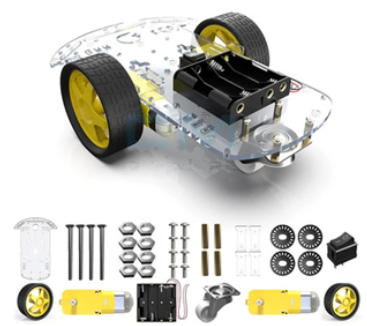
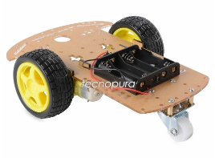
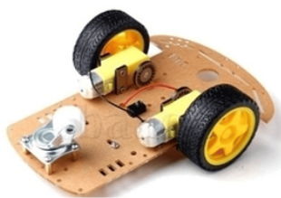

[Regresar](/BootcampKidsESPOL/)

Día 4 

**Realizaremos** la misma práctica del día anterior, pero implementado con los materiales físicos, y siguiendo cada uno de los pasos indicados por el instructor. 

Después procederemos con la siguiente actividad 

Actividad: ensamblar un kit de robot Verificar que todos los componentes se encuentren en su mesa de trabajo 

a. Dos ruedas. 
b. Dos motores. 
c. 4 jumpers. 
d. Una rueda loca. 
e. Porta pilas. 
f. 4 pilas AA. 
g. Juego de destornilladores. 
h. tornillos. 

  

  

2. Ajustamos la rueda loca a la base 

3. Ajustamos cada uno de los motores a la base de acrílico 

4. Colocamos las dos ruedas en el eje de cada motor 

  

5. En la parte superior pegaremos el portapilas y el interruptor