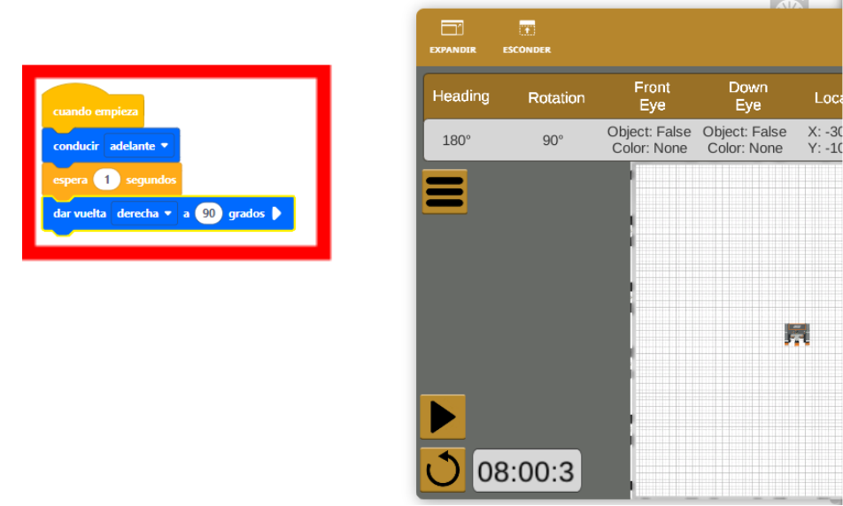

[Regresar](/BootcampsKidsESPOL/)

## Semana 2 

## 1er día 

1. Abrir el siguiente enlace que permitirá simular un carrito con programación bloques: 
https://vr.vex.com/ 

2. A continuación, hacer clic en la parte superior derecha en la opción patio abierto y esperamos a que se abra una ventana nueva. 

  

  

3. Vamos a colocar el bloque de conducir adelante ubicado en tren Motriz, y después le damos play y observamos el movimiento del carro

  

 
4. Le damos a stop, y ahora vamos a agregar un tiempo de espera de 1 segundo y un giro de 90 grados 

  

5. Ahora le damos play y podremos observar que el carro avanza por un segundo, gira 90 grados y se detiene 

6. Actividad a realizar por ustedes, creen una programación para que el carro, realice el movimiento de “dibujar” un cuadrado 